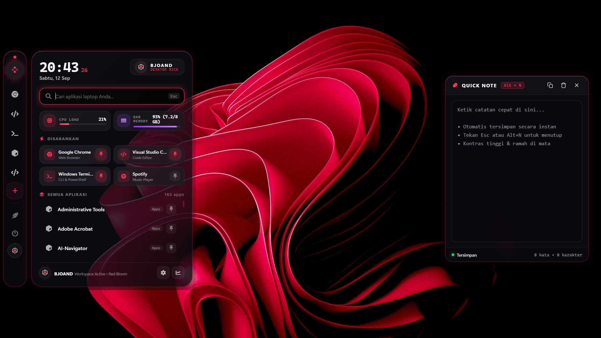

# 🪟 Bglass-Shell (BJOAND)

<p align="center">
  
</p>

<p align="center">
  <a href="https://github.com/git-bjoand/Bglass-shell"></a>
  <a href="https://www.electronjs.org/"></a>
  
  <a href="LICENSE"></a>
</p>

<p align="center">
  <b>A lightweight, glassmorphic desktop environment & productivity dock for Windows 10/11.</b>
</p>

<p align="center">
  <a href="#-key-features">Key Features</a> •
  <a href="#-quick-start">Quick Start</a> •
  <a href="#-shortcuts--controls">Shortcuts</a> •
  <a href="#-auto-start-on-windows-boot-silent">Auto-Start</a> •
  <a href="#-project-structure">Project Structure</a>
</p>

---

## ✨ Overview

**Bglass-Shell** is a minimalist, frosted glass desktop environment and productivity suite engineered with native Electron. Designed to float gracefully above your existing desktop wallpaper, **Bglass-Shell** combines two powerful tools into one seamless interface:

1. 📱 **Glass Dock & App Launcher (Left Sidebar)**: Auto-scaling dock, Start Menu search engine, real-time hardware telemetry (CPU & RAM), and native power controls.
2. 📝 **Instant Quick Note (`Alt + N`)**: Distraction-free, high-contrast obsidian scratchpad with live dual auto-save and live word/character counters.

> [!TIP]
> **Zero Distraction, Ultra-Low Footprint**: Consumes only ~60–100 MB of RAM with 0% idle CPU overhead, leaving your system resources completely free for gaming and heavy workloads.

---

## ⚡ Key Features

<details open>
<summary><b>1. Clean Glass Dock & Search Panel (Left Edge)</b></summary>
<br>

* **🎯 Zero-Hitbox Idle Passthrough**: Idle dock shrinks to a discreet 16px edge indicator. Mouse clicks pass 100% through to background games and windows (`setIgnoreMouseEvents(true, { forward: true })`).
* **📐 Dynamic Auto-Scaling**: Dock height automatically adjusts based on the number of pinned applications (supports up to 8 pinned shortcuts).
* **🔍 Start Menu Search Engine**: Instant filtering and launching of all installed Windows applications.
* **📊 Hardware Telemetry Widgets**: Real-time CPU Load (%) and RAM Memory utilization (GB / %) monitoring bars.
* **➕ Direct App Picker**: Pick any executable (`.exe`), shortcut (`.lnk`), or file directly from File Explorer.
* **🔒 Power & Session Manager**: Floating popover menu for Shutdown, Restart, Sleep, Hibernate, and Lock Screen.

</details>

<details open>
<summary><b>2. Instant Quick Note (Right Panel — <code>Alt + N</code>)</b></summary>
<br>

* **⌨️ Global Hotkey (`Alt + N`)**: Instantly summon and dismiss the note scratchpad from anywhere in Windows.
* **🌙 High-Contrast Obsidian Glass**: Ultra-legible typography on dark frosted glass (contrast ratio > 18:1).
* **💾 Dual Keystroke Auto-Save**: Instant sync to `localStorage` and background persistence to `quicknote.txt`.
* **📋 Clipboard & Quick Actions**: Copy to clipboard with instant toast notifications, clear note, and close buttons.
* **🔢 Live Counter**: Live word and character counting (`X kata | Y karakter`).

</details>

<details open>
<summary><b>3. Performance & Design Aesthetics</b></summary>
<br>

* **🚀 Standalone & Bloat-Free**: Completely independent of third-party wallpaper engines or heavy frameworks.
* **🖼️ Translucent Frosted Glass**: Uses backdrop blur and glassmorphism styling that blends with any desktop wallpaper.
* **🛡️ Silent Windows Boot**: Includes a VBScript launcher (`Bglass-shell.vbs`) for invisible startup without CMD console windows.

</details>

---

## 💻 System Requirements

| Component | Minimum / Recommended |
| :--- | :--- |
| **OS** | Windows 10 (Build 19041+) or Windows 11 (64-bit) |
| **Runtime** | Node.js v18.0.0+ (v20 or v24 recommended) |
| **Framework** | Electron 34+ |
| **RAM** | ~60–100 MB active footprint |

---

## 🚀 Quick Start

### 1. Clone the Repository
```bash
git clone https://github.com/git-bjoand/Bglass-shell.git
cd Bglass-shell
```

### 2. Install Dependencies
```bash
npm install
```

### 3. Launch Bglass-Shell
Run via command line or double-click `Bglass-shell.bat`:

```bash
npm start
```

---

## ⚙️ Auto-Start on Windows Boot (Silent)

To launch **Bglass-Shell** automatically when Windows starts without any console flashes:

1. Press <kbd>Win</kbd> + <kbd>R</kbd> to open the **Run** dialog.
2. Type `shell:startup` and press **Enter** to open your Windows Startup folder.
3. Right-click inside the folder > **New** > **Shortcut**.
4. Set the Target path to:
   ```text
   wscript.exe "D:\project\bjoand-shell\Bglass-shell.vbs"
   ```
   *(Adjust the folder path if your repository is located elsewhere).*
5. Name the shortcut `Bglass-Shell` and click **Finish**.

> [!NOTE]
> **Why `Bglass-shell.vbs`?**  
> `Bglass-shell.vbs` executes the launcher script silently in the background, preventing black CMD windows from popping up during login.

---

## ⌨️ Shortcuts & Controls

| Shortcut / Trigger | Description / Action |
| :--- | :--- |
| <kbd>Alt</kbd> + <kbd>N</kbd> | Toggle Quick Note scratchpad from anywhere. |
| **Hover Left Screen Edge** | Reveal and slide out the glass dock from idle mode. |
| <kbd>Esc</kbd> | Dismiss Quick Note, search dropdown, or power popover. |
| **Click Outside / <kbd>Win</kbd>** | Collapse dock back into 16px idle indicator. |
| **Click `(+)` on Dock** | Open File Explorer to select and pin an application. |

---

## 📁 Project Structure

```text
Bglass-shell/
├── Bglass-shell.bat        # Batch file launcher
├── Bglass-shell.vbs        # Silent VBScript launcher for Windows Startup
├── image.png               # Showcase preview screenshot
├── index.html              # Glass Dock & Sidebar interface
├── style.css               # Glassmorphism styling, animations & theme
├── script.js               # Dock controller, app search & hardware telemetry
├── note.html               # Quick Note scratchpad window
├── note.css                # Obsidian glass styling for scratchpad
├── note.js                 # Dual auto-save & word counter logic
├── quicknote.txt           # Persistent local file storage for notes
├── main.js                 # Electron main process & IPC window manager
└── package.json            # Manifest & project metadata
```

---

## 📄 License

This project is open-source and licensed under the **MIT License**. Free to use, customize, and distribute.
